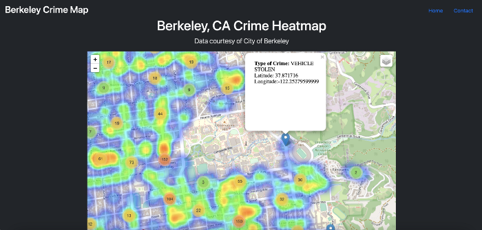
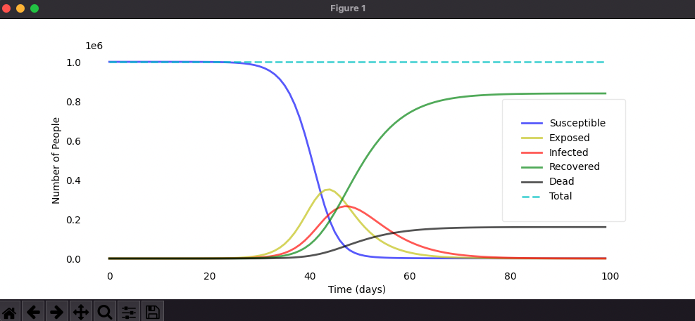

# About Me

Hello, my name is Ayden Salazar and I'm a senior studying Data Science at the University of California, Berkeley with an expected graduation date of December, 2022. I have a passion for finding data-driven solutions to real-world problems, especially in the context of public health and epidemiology. When I'm not geeking out over a Data Science project, you can find me leading runs as president of UC Berkeley's Running Club, making short films with friends, and going on hiking adventures.

I love meeting new people! Feel free to reach out for anything whatsoever at aydensalazar09@gmail.com.

# Noteworthy Projects

## [Predicting Summary Statistics For Mosquito Gene Drive Using Deep Learning](https://github.com/Chipdelmal/MoNeT_ML/blob/main/DSDP/STP/AydenSalazar/AydenSalazarMarkdownReport.md)

 
 

## [Particle Swarm Optimization for Mosquito Trap Placement](https://github.com/Chipdelmal/MGSurvE/blob/main/MGSurvE/optimizationPSO.py)

 
 

## [Predicting Number of Solar Panels For U.S Counties](https://github.com/aydensalazar/usa-solar-panel-prediction/blob/master/ER%20131%20Final%20Project%20Group%202-1.ipynb)

 
 

## [Online Interactive Berkeley Crime Heat Map](https://medium.com/codex/how-i-deployed-a-crime-heatmap-application-using-python-flask-and-heroku-48b9dfb5362f)

 
 

## [Build-Your-Own COVID-19 SEIRD Epidemic Model](https://github.com/aydensalazar/covid19seirdproject)

 
 

## [Baseball Pitch Type Prediction](https://github.com/aydensalazar/baseball-pitch-prediction)

 
 

### [Check out my entire GitHub here](https://github.com/aydensalazar/)